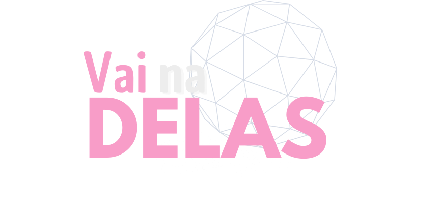
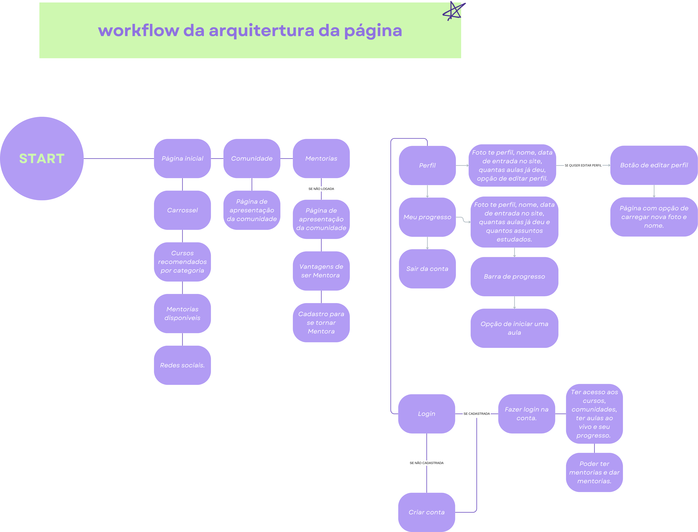

# EQUIPE 14 - HACKING.HER 2024

#
### Apresentação
Somos a **Vai na Delas**, um time de 5 mulheres diversas.
Nossa principal motivação é estabelecer **Inclusão, Igualdade, Inovação, Empoderamento e Colaboração.** 

**O Desafio** ------------------------------------------

Como aumentar a participação das mulheres na formação nas áreas da tecnologia e inovação.

**O projeto** ------------------------------------------ 

"Vai na Delas" é mais do que apenas uma plataforma web SaaS (Software as a Service); o objetivo é criar um movimento dedicado a remodelar o panorama tecnológico, oferecendo um espaço onde mulheres podem crescer, inovar e liderar. Nossa missão é empoderar mulheres através do acesso a educação de qualidade, mentoria especializada e uma rede de networking robusta, tudo isso com o foco na tecnologia e inovação.

Nós acreditamos na força da inclusão, igualdade, inovação, empoderamento e colaboração. Estes são os valores que nos guiam e inspiram a construir uma comunidade vibrante, onde mulheres interessadas em tecnologia, estudantes, profissionais em início de carreira, ou aquelas em transição para áreas técnicas, bem como líderes estabelecidas, possam encontrar um lugar para aprender, ensinar e avançar juntas.

Em "Vai na Delas", é disponibilizado cursos gratuitos e aulas ao vivo promovida pelas própias usuárias, facilitando o aprendizado dinâmico e direto, além de sessões de mentoria personalizadas com mulheres que são lideres e referências em suas áreas. Com nossa plataforma, não apenas abrimos portas para novas oportunidades, mas também criamos um ambiente seguro e propício para que cada usuária possa prosperar e impactar positivamente a indústria da tecnologia e inovação.

## Como funciona
> **1º Entrar na plataforma**
	- Você tira uma foto do animal avistado e faz o upload do arquivo. Assim, o animal será identificado e você saberá seu nome, por onde ele nadou e data das aparições. 

> **2º Cria conta e faz o login** 
	- Se o animal ainda não estiver registrado em nossa base de dados, você poderá registrá-lo e dar um nome a ele! 

> **3º Tem acesso aos conteúdos** 
	- Você também pode acompanhar os animais que estão próximos a você pode meio de um radar de localização. 

  ## Arquitetura base
  
   

  ### Stack utilizada

  **Front-end:** React, styled-componets.

  ### Funcionalidades

    - Perfil de usuária
    - Meu Progresso
    - Promover uma aula
    - Assistir aula

 ### Identidade visual

<iframe src="https://drive.google.com/file/d/1xVuqe86K1Iz0mr6eJRO85hBw8TCDGfRr/view?usp=sharing" width="100%" height="500px">
    Seu navegador não suporta iframes.
</iframe>
